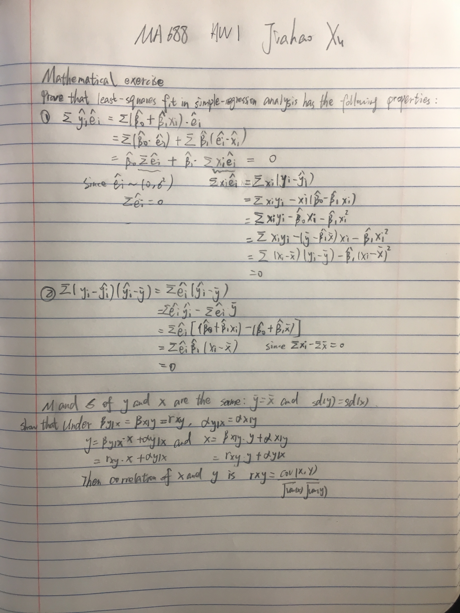

\newcommand{\mat}[1]{\boldsymbol{#1}} 
\newcommand{\norm}[1]{\left\lVert#1\right\rVert}
\newcommand{\rv}[1]{\underline{#1}} 

```{r setup, include=FALSE}
pacman::p_load(ggplot2, knitr, arm, data.table,Cairo)
knitr::opts_chunk$set(echo = TRUE,dev="CairoPNG",fig.align = "center", 
                      fig.width = 5.656, fig.height = 4, global.par = TRUE)
par (mar=c(3,3,2,1), mgp=c(2,.7,0), tck=-.01)
```

# Introduction 

For homework 1 you will fit linear regression models and interpret them. You are welcome to transform the variables as needed.  How to use `lm` should have been covered in your discussion session.  Some of the code are written for you.  Please remove `eval=FALSE` inside the knitr chunk options for the code to run.


This is not intended to be easy so please come see us to get help.

## Data analysis 

### Pyth!

```{r}
gelman_example_dir<-"http://www.stat.columbia.edu/~gelman/arm/examples/"
pyth <- read.table (paste0(gelman_example_dir,"pyth/exercise2.1.dat"),
                    header=T, sep=" ")
```

The folder pyth contains outcome `y` and inputs `x1`, `x2` for 40 data points, with a further 20 points with the inputs but no observed outcome. Save the file to your working directory and read it into R using the `read.table()` function.

1. Use R to fit a linear regression model predicting `y` from `x1`,`x2`, using the first 40 data points in the file. Summarize the inferences and check the fit of your model.
```{r}
first_40<-pyth[0:40,]
lm1<-lm(y~x1+x2,data=first_40)
summary(lm1)


```

2. Display the estimated model graphically as in (GH) Figure 3.2.
```{r}
library(ggplot2)
pyth40<-ggplot(first_40)
pyth40+aes(x=x1+x2,y=y)+geom_point()+ 
  stat_smooth(method = "lm", col = "red")

```

3. Make a residual plot for this model. Do the assumptions appear to be met?
```{r}
plot(lm1$residuals)
abline(h=0)
# According to the graph, the assumptions appear to be met. Centered with 0 and not symmetric.
```

4. Make predictions for the remaining 20 data points in the file. How confident do you feel about these predictions?
```{r}
# I'm 95% confident in it according to the success in the first 40 data points prediction.
predt<-predict(lm1,data.frame(pyth[41:60,2:3]),interval='prediction')
predt
```

After doing this exercise, take a look at Gelman and Nolan (2002, section 9.4) to see where these data came from. (or ask Masanao)

### Earning and height
Suppose that, for a certain population, we can predict log earnings from log height as follows:

- A person who is 66 inches tall is predicted to have earnings of $30,000.
- Every increase of 1% in height corresponds to a predicted increase of 0.8% in earnings.
- The earnings of approximately 95% of people fall within a factor of 1.1 of predicted values.

1. Give the equation of the regression line and the residual standard deviation of the regression.
# The regression mode should be earnings=B0+B1*height. Let y=earnings and x=height
# Then the log equation should be log(y)=B0+B1*log(x)
# Then we plot the two conditions into the log eqution, we get
# log(30000)=B0+B1*log(66) (1)
# log(1.008y)=B0+B1*log(1.01x) (2)
# From equation(2), we get log(1.008)+1og(y)=B0+B1*log(1.01)+B1*log(x)
# log(1.008)=B1*log(1.01), we get B1=0.8. Then we plot it into equation (1)
# log(30000)=B0+0.8*log(66). Then B0=log(30000)-0.8*log(66)=6.96
# Therefore, the equation of the regression line is log(y)=6.96+0.08*log(x)
# The residual standard deviation of the regression is log(1.1)/2=0.048
sd<- 0.048
2. Suppose the standard deviation of log heights is 5% in this population. What, then, is the $R^2$ of the regression model described here?
sdtot<- 0.05
R2<- 1- (sd^2/sdtot^2)
R2


### Beauty and student evaluation 

The folder beauty contains data from Hamermesh and Parker (2005) on student evaluations of instructors' beauty and teaching quality for several courses at the University of Texas. The teaching evaluations were conducted at the end of the semester, and the beauty judgments were made later, by six students who had not attended the classes and were not aware of the course evaluations.
```{r}
beauty.data <- read.table (paste0(gelman_example_dir,"beauty/ProfEvaltnsBeautyPublic.csv"), header=T, sep=",")
```

1. Run a regression using beauty (the variable btystdave) to predict course evaluations (courseevaluation), controlling for various other inputs. Display the fitted model graphically, and explaining the meaning of each of the coefficients, along with the residual standard deviation. Plot the residuals versus fitted values.

```{r}
mod<-lm(courseevaluation~btystdave+minority+age,data=beauty.data)
summary(mod)
coef(mod)
plot(fitted(mod))
fittedValues <- fitted(mod)
Residuals   <- resid(mod)
plot(fittedValues,Residuals)
## Explaining the meaning of each of the coefficients: when the students have btystdave of zero and has no minority(minority is 0) and age is 0, they will have 4.04 in the courseevaluation. Each point increased in the beauty will coursevaluation  make the  increase 0.134. Students with minority will decrease the coursevaluation by 0.133. Each higher age will lead to 0.0002 decrease in the coursevaluation .
```

2. Fit some other models, including beauty and also other input variables. Consider at least one model with interactions. For each model, state what the predictors are, and what the inputs are, and explain the meaning of each of its coefficients.

```{r}
mod2<-lm(btystdave~courseevaluation+age+female,data=beauty.data)
summary(mod2)
mod3<-lm(btystdave~courseevaluation*age+female,data=beauty.data)
summary(mod3)

# In mod2, the predictors are btystdave, inputs are courseevaluation+age+female. The intercept means that when the courseevaluation is 0, age is 0 and female is 0, the btystdave is -0.168. Each one increase in coursevaluation will increase btystdave in 0.268. Each one increase in age will decrease coursevaluation in 0.021. People who are female will have 0.124 higher in btystdave.

# In mod3, the predictors are btystdave, inputs are courseevaluation+age+female. The intercept means that when the courseevaluation is 0, age is 0 and female is 0, the btystdave is 2.26. Each one increase in coursevaluation or each one increase in age don't have single effect on btystdave. When they both increase by 1, the btystdave will increase by 0.0124.  People who are female will have 0.132 higher in btystdave.
```

See also Felton, Mitchell, and Stinson (2003) for more on this topic 
[link](http://papers.ssrn.com/sol3/papers.cfm?abstract_id=426763)

# Conceptula excercises

### On statistical significance.

Note: This is more like a demo to show you that you can get statistically significant result just by random chance. We haven't talked about the significance of the coefficient so we will follow Gelman and use the approximate definition, which is if the estimate is more than 2 sd away from 0 or equivalently, if the z score is bigger than 2 as being "significant".

 ( From Gelman 3.3 ) In this exercise you will simulate two variables that are statistically independent of each other to see what happens when we run a regression of one on the other.  

1. First generate 1000 data points from a normal distribution with mean 0 and standard deviation 1 by typing in R. Generate another variable in the same way (call it var2).

```{r, eval=FALSE}
var1 <- rnorm(1000,0,1)
var2 <- rnorm(1000,0,1)
```

Run a regression of one variable on the other. Is the slope coefficient statistically significant? [absolute value of the z-score(the estimated coefficient of var1 divided by its standard error) exceeds 2]

```{r, eval=FALSE}
fit  <- lm (var2 ~ var1)
z.scores <- coef(fit)[2]/se.coef(fit)[2]
z.scores
```

2. Now run a simulation repeating this process 100 times. This can be done using a loop. From each simulation, save the z-score (the estimated coefficient of var1 divided by its standard error). If the absolute value of the z-score exceeds 2, the estimate is statistically significant. Here is code to perform the simulation:

```{r}
z.scores <- rep (NA, 100) 
for (k in 1:100) {
  var1 <- rnorm (1000,0,1)
  var2 <- rnorm (1000,0,1)
  fit  <- lm (var2 ~ var1)
  z.scores[k] <- coef(fit)[2]/se.coef(fit)[2]
}
```
How many of these 100 z-scores are statistically significant? 
result<-0
for(i in 1:length(z.scores)){
  if (z.scores[i]>2){
  result=result+1
  }
}
result
What can you say about statistical significance of regression coefficient?
# The statistical significance of regression coefficient is determined by dividing the estimated coefficient over the standard deviation of this estimate. If the z-value based on t distribution is bigger than 2 or the p-value is less than the significant level, it is significant.  


### Fit regression removing the effect of other variables

Consider the general multiple-regression equation
$$Y=A+B_1 X_1 + B_2 X_2 +\cdots + B_kX_k+E$$
An alternative procedure for calculating the least-squares coefficient $B_1$ is as follows:

1. Regress $Y$ on $X_2$ through $X_k$, obtaining residuals $E_{Y|2,\dots,k}$.
2. Regress $X_1$ on $X_2$ through $X_k$, obtaining residuals $E_{1|2,\dots,k}$.
3. Regress the residuals $E_{Y|2,\dots,k}$ on the residuals $E_{1|2,\dots,k}$.  The slope for this simple regression is the multiple-regression slope for $X_1$ that is, $B_1$.

(a)  Apply this procedure to the multiple regression of prestige on education, income, and percentage of women in the Canadian occupational prestige data (http://socserv.socsci.mcmaster.ca/jfox/Books/Applied-Regression-3E/datasets/Prestige.pdf), confirming that the coefficient for education is properly recovered.

```{r}
fox_data_dir<-"http://socserv.socsci.mcmaster.ca/jfox/Books/Applied-Regression-3E/datasets/"
Prestige<-read.table(paste0(fox_data_dir,"Prestige.txt"))
mod1<-lm(prestige~income+women+census,data=Prestige)
mod2<-lm(education~income+women+census,data=Prestige)
residuals1<-resid(mod1)
residuals2<-resid(mod2)
mod3<-lm(residuals1~residuals2,data=Prestige)
coefficients(mod3)
mod_normal<-lm(prestige~education+income+women+census,data=Prestige)
coefficients(mod_normal)
# From the result, we know that both coefficients of mod3 and mod_normal are 4.657. Therefore, it is properly recovered.
```
(b) The intercept for the simple regression in step 3 is 0.  Why is this the case?
# We use the  residuals of $E_{Y|2,\dots,k}$ and the residuals of $E_{1|2,\dots,k}$ to do the linear regression. At this situation, we want that E(epsilon1)=E(a*epsilon2+b). And we know that both E(epsilon1) and E(epsilon2) are 0. Therefore, a, the slope, is 0.
(c) In light of this procedure, is it reasonable to describe $B_1$ as the "effect of $X_1$ on $Y$ when the influence of $X_2,\cdots,X_k$ is removed from both $X_1$ and $Y$"?
# It is not reasonable to describe like this. Because when we remove all other effects from X_1 and Y. The coefficient B_1 will change as well.
(d) The procedure in this problem reduces the multiple regression to a series of simple regressions ( in Step 3). Can you see any practical application for this procedure?
# Sometimes, we want to determine effect of the most significant predicator, like education, and eliminate other predicators' effects. Therefore, we use this method to get B_1.


### Partial correlation 

The partial correlation between $X_1$ and $Y$ "controlling for" $X_2,\cdots,X_k$ is defined as the simple correlation between the residuals $E_{Y|2,\dots,k}$ and $E_{1|2,\dots,k}$, given in the previous exercise. The partial correlation is denoted $r_{y1|2,\dots, k}$.

1. Using the Canadian occupational prestige data, calculate the partial correlation between prestige and education, controlling for income and percentage women.

```{r}
mod1<-lm(prestige~income+women,data=Prestige)
mod2<-lm(education~income+women,data=Prestige)
residuals1<-resid(mod1)
residuals2<-resid(mod2)
Correlation<-cor(residuals1,residuals2)
```

2. In light of the interpretation of a partial regression coefficient developed in the previous exercise, why is $r_{y1|2,\dots, k}=0$ if and only if $B_1$ is 0?
# When we calculate a partial regression coefficient, we have to eliminate the effects of other inputs. Only when B_1 is 0, the effect of X_1 will be ignored.


## Mathematical exercises.

Prove that the least-squares fit in simple-regression analysis has the following properties:

1. $\sum \hat{y}_i\hat{e}_i =0$

2. $\sum (y_i-\hat{y}_i)(\hat{y}_i-\bar{y}) =\sum \hat{e}_i (\hat{y}_i-\bar{y})=0$

Suppose that the means and standard deviations of $\mat{y}$ and  $\mat{x}$ are the same:  $\bar{\mat{y}}=\bar{\mat{x}}$ and $sd(\mat{y})=sd(\mat{x})$.

1. Show that, under these circumstances 
$$\beta_{y|x}=\beta_{x|y}=r_{xy}$$
where $\beta_{y|x}$ is the least-squares slope for the simple regression of $\mat{y}$ on $\mat{x}$, $\beta_{x|y}$ is the least-squares slope for the simple regression of $\mat{x}$ on $\mat{y}$, and $r_{xy}$ is the correlation between the two variables. Show that the intercepts are also the same, $\alpha_{y|x}=\alpha_{x|y}$.

2. Why, if $\alpha_{y|x}=\alpha_{x|y}$ and $\beta_{y|x}=\beta_{x|y}$, is the least squares line for the regression of $\mat{y}$  on $\mat{x}$ different from the line for the regression of $\mat{x}$ on $\mat{y}$ (when $r_{xy}<1$)?

3. Imagine that educational researchers wish to assess the efficacy of a new program to improve the reading performance of children. To test the program, they recruit a group of children who are reading substantially vbelow grade level; after a year in the program, the researchers observe that the children, on average, have imporved their reading performance.  Why is this a weak research design?  How could it be improved?



# Feedback comments etc.

If you have any comments about the homework, or the class, please write your feedback here.  We love to hear your opnions.

